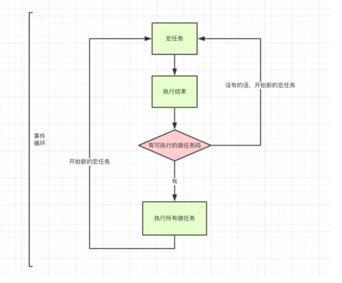

> 学习Event loop之前建议先去了解一下[微任务与宏任务](../Js/10-js.md)

在Event Loop中，每一次循环称为tick，每一次tick的任务如下：
+ 执行栈选择最先进入队列的宏任务（一般都是script），执行其同步代码直至结束；
+ 检查是否存在微任务，有则会执行至微任务队列为空；
+ 如果宿主为浏览器，可能会渲染页面；
+ 开始下一轮tick，执行宏任务中的异步代码（setTimeout等回调）。

### 事件循环机制
单线程的运行环境有且只有一个`call-stack`调用栈(执行栈)，所有的任务(代码)都会被放到调用栈等待浏览器的主线程执行。

此时`整体代码script`作为第一个宏任务开始执行，执行到异步代码时会先把异步代码放到`event Table/webapi`注册，注册之后根据异步代码选择放入微任务/宏任务的event queue，同时继续执行主线程中的同步代码。

整体代码执行完之后event loop会先检查微任务Event Queue队列中有没有回调函数，如果有就将它放到执行栈中执行(执行完一个函数检查一次队列，如果队列还有函数就再继续执行下一个一个函数，以此类推队列的函数一个一个执行)，执行完微任务Event Queue后第一轮事件循环就结束了。

第二轮循环事件开始，先从宏任务开始，发现宏任务Event Queue中有上一轮保存的回调函数，立即执行，执行完检查该回调函数中有没有微任务，有就放入微任务Eevent Queue，执行完宏任务之后就又执行刚刚放入的微任务，结束
后续如果有嵌套更多的微/宏任务就继续像上面一样循环，直到执行完所有代码

