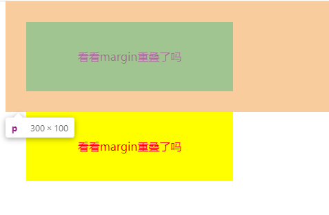
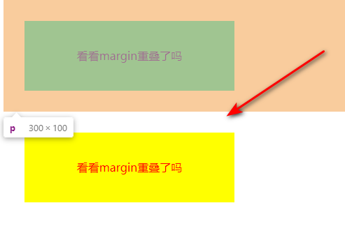
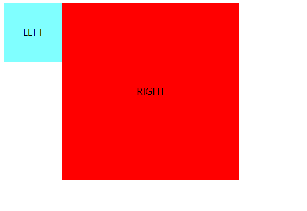
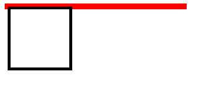
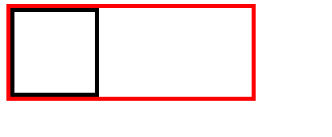

BFC是一个独立的布局环境，其中的元素布局是不受外界的影响，并且在一个BFC中，块盒与行盒（行盒由一行中所有的内联元素所组成）都会垂直的沿着其父元素的边框排列。
### 如何创建BFC？
+ 根元素(`<html>`)
+ float的值不是`none`
+ position的值不是`static`或者`relative`
+ display的值是`inline-block`、`table-cell`、`flex`、`grid`、`table-caption`、`inline-grid`或者`inline-flex`
+ overflow的值不是`visible`

### BFC有三个作用，我们一起来看看
#### 1. 利用BFC可以避免margin重叠

下面的代码就会出现margin重叠的情况，上面元素的margin-bottom和下面元素的margin-top重叠了
```HTML
<style>
    p {
        color: #ff0000;
        background-color: #ffff00;
        text-align: center;
        width: 300px;
        line-height: 100px;
        margin: 30px;
    }
</style>
<body>
    <p>看看margin重叠了吗</p>
    <p>看看margin重叠了吗</p>
</body>
```


想要解决这种情况可以将其中一个元素设置成BFC，只需要给该元素用div包起来并设置overflow就ok了
```HTML
<style> 
    p {
        color: #ff0000;
        background-color: #ffff00;
        text-align: center;
        width: 300px;
        line-height: 100px;
        margin: 30px;
    }
    div {
        overflow: hidden;
    }
</style>
<body>
    <p>看看margin重叠了吗</p>
    <div>
        <p>看看margin重叠了吗</p>
    </div>
</body>
```



由此可见现在这两个元素的margin不会再出现重叠了

#### 2. BFC的区域不会与浮动元素重叠
以下例子中，只要其中一个div设置了浮动，就会出现两个div重叠的情况
```HTML
<style>
   .left {
       float: left;
       width: 100px;
       line-height: 100px;
       text-align: center;
       background-color: #80ffff;
   }
   .right {
        width: 300px;
        line-height: 300px;
        text-align: center;
        background-color: #ff0000;
   }
</style>
<body>
    <div class="left">LEFT</div>
    <div class="right">RIGHT</div>
</body>
```


想要解决它很简单，就把另一个div设置成BFC。(设置overflow属性)
```HTML
<style>
   .left {
       float: left;
       width: 100px;
       line-height: 100px;
       text-align: center;
       background-color: #80ffff;
   }
   .right {
        width: 300px;
        line-height: 300px;
        text-align: center;
        background-color: #ff0000;
        overflow: hidden;/* 在原来的样式上加上overflow属性即可 */
   }
</style>
<body>
    <div class="left">LEFT</div>
    <div class="right">RIGHT</div>
</body>
```


这样就实现了浮动元素重叠的问题

#### 3. 开启BFC的元素可以包含浮动的子元素，不会出现高度坍塌
当我们不给父元素设置高度，子元素设置浮动的时候，会发生高度塌陷
```HTML
<style>   
   .parent {
       width: 300px;
       border: 5px solid #ff0000;
   }
   .child {
       border: 5px solid #000000;
       float: left;
       width: 100px;
       height: 100px;
   }
</style>
<body>
    <div class="parent">
        <div class="child"></div>
    </div>
</body>
```


可以看见现在子元素并没有把父元素撑开，导致了高度坍塌；这时把父元素设置成BFC即可
```HTML
<style>   
   .parent {
       width: 300px;
       border: 5px solid #ff0000;
       overflow: hidden;/* 在原来的样式上加上overflow属性即可 */
   }
   .child {
       border: 5px solid #000000;
       float: left;
       width: 100px;
       height: 100px;
   }
</style>
<body>
    <div class="parent">
        <div class="child"></div>
    </div>
</body>
```


这时子元素可以撑开了父元素，就不再出现高度坍塌的情况了

#### 其实我们可以把BFC想成是页面上的一个独立的容器(盒子)，容器里面元素不会影响到外面的元素,外面的元素也不会影响容器内的元素。